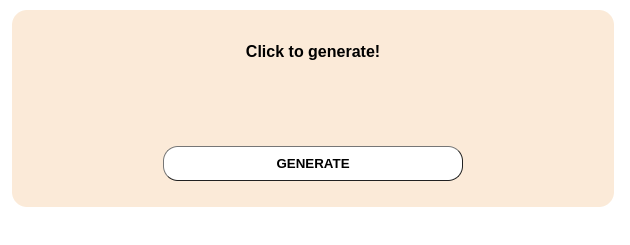
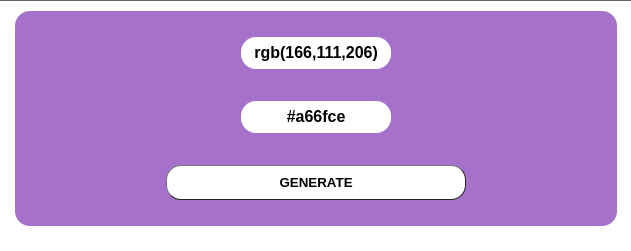

# Random Color Generator

A very simple algorithm that generates a new color every time than the button is pressed.
> Home page
>
>
>
>When the button **GENERATE** is activated it executes the main function at the **script.js** file and a new color is generated.

>The new color is created as the background color of the card, and the **RGB** and **HEX** exhibition patterns are displayed.
>
>Exemples:
>
>
>
>